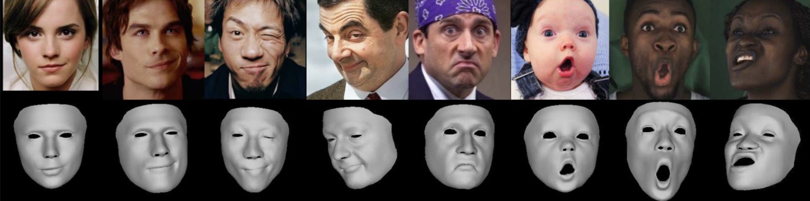

# SMIRK: 3D Facial Expressions through Analysis-by-Neural-Synthesis

This is the official PyTorch implementation of SMIRK:
This repository is the official implementation of the [CVPR 2024](https://cvpr.thecvf.com) paper [3D Facial Expressions through Analysis-by-Neural Synthesis](https://arxiv.org/abs/2404.04104).


<p align="center">
  <a href='https://arxiv.org/abs/2404.04104' style='padding-left: 0.5rem;'>
    
  </a>
  <!-- <a href=''>
    
  </a>  -->
  <!-- <a href=''>
    
  </a>      -->
  <a href='https://www.youtube.com/watch?v=8ZVgr41wxbk' style='padding-left: 0.5rem;'>
    
  </a>
  <a href='https://georgeretsi.github.io/smirk/' style='padding-left: 0.5rem;'>
    
  </a>
</p>

<p align="center"> 

SMIRK reconstructs 3D faces from monocular images with facial geometry that faithfully recover extreme, asymmetric, and subtle expressions.
</p>


## Installation
You need to have a working version of PyTorch and Pytorch3D installed. We provide a `requirements.txt` file that can be used to install the necessary dependencies for a Python 3.9 setup with CUDA 11.7:

```bash
conda create -n smirk python=3.9
pip install -r requirements.txt
# install pytorch3d now
pip install --no-index --no-cache-dir pytorch3d -f https://dl.fbaipublicfiles.com/pytorch3d/packaging/wheels/py39_cu117_pyt201/download.html
```

Then, in order to download the required models, run:

```bash
bash quick_install.sh
```


## Demo 
We provide a demo that can be used to test the model on a single image or a video file. 

```bash
python demo.py --input_path samples/test_image2.png --out_path results/ --checkpoint pretrained_models/SMIRK_em1.pt --crop
```


## Training
<details>
<summary>Dataset Preparation</summary>

SMIRK was trained on a combination of the following datasets: LRS3, MEAD, CelebA, and FFHQ. 

1. ~~§§Download the LRS3 dataset from [here](https://www.robots.ox.ac.uk/~vgg/data/lip_reading/lrs3.html).~~ We are aware that currently this dataset has been removed from the website. It can be replaced with any other similar dataset, e.g. [LRS2](https://www.robots.ox.ac.uk/~vgg/data/lip_reading/lrs2.html). 

2. Download the MEAD dataset from [here](https://wywu.github.io/projects/MEAD/MEAD.html).

3. Download the CelebA dataset from [here](https://mmlab.ie.cuhk.edu.hk/projects/CelebA.html). You can download directly the aligned images `img_align_celeba.zip`.

4. Download the FFHQ256 dataset from [here](https://www.kaggle.com/datasets/denislukovnikov/ffhq256-images-only). 

After downloading the datasets we need to extract the landmarks using mediapipe and FAN. We provide the scripts for preprocessing in `datasets/preprocess_scripts`. Example usage:

```bash
python datasets/preprocess_scripts/apply_mediapipe_to_dataset.py --input_dir PATH_TO_FFHQ256/images --output_dir PATH_TO_FFHQ256/mediapipe_landmarks
```

and for FAN:

```bash
python datasets/preprocess_scripts/apply_fan_to_dataset.py --input_dir PATH_TO_FFHQ256/images --output_dir PATH_TO_FFHQ256/fan_landmarks
```

Note that for obtaining the FAN landmarks we use the implementation in [https://github.com/hhj1897/face_alignment](https://github.com/hhj1897/face_alignment).

Next, make sure to update the config files in `configs` with the correct paths to the datasets and their landmarks.

</details>

### Pretraining
At the pretraining stage, we train all 3 encoders (pose, shape, and expression) using only the extracted landmarks and the output of [MICA](https://zielon.github.io/mica/). 
```bash
python train.py configs/config_pretrain.yaml train.log_path="logs/pretrain"
```


### Training
After pretraining, at the core stage of SMIRK, we freeze the shape and pose encoders and train the expression encoder with the full SMIRK framework (reconstruction path and cycle path). 

```bash
python train.py configs/config_train.yaml resume=logs/pretrain/first_stage_pretrained_encoder.pt train.loss_weights.emotion_loss=1.0
```


## Citation
If you find this work useful, please consider citing:

```bibtex
@inproceedings{SMIRK:CVPR:2024,
    title = {3D Facial Expressions through Analysis-by-Neural-Synthesis},
    author = {Retsinas, George and Filntisis, Panagiotis P., and Danecek, Radek and Abrevaya, Victoria F. and Roussos, Anastasios and Bolkart, Timo and Maragos, Petros},
    booktitle = {Conference on Computer Vision and Pattern Recognition (CVPR)},
    year = {2024}
}
```


## Acknowledgements 
We acknowledge the following repositories and papers that were used in this work:

- [MICA](https://zielon.github.io/mica/)
- [EMOCA](https://emoca.is.tue.mpg.de)
- [AutoLink](https://github.com/xingzhehe/AutoLink-Self-supervised-Learning-of-Human-Skeletons-and-Object-Outlines-by-Linking-Keypoints)
